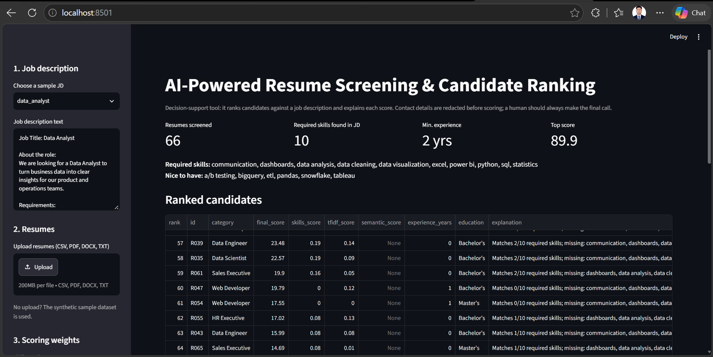
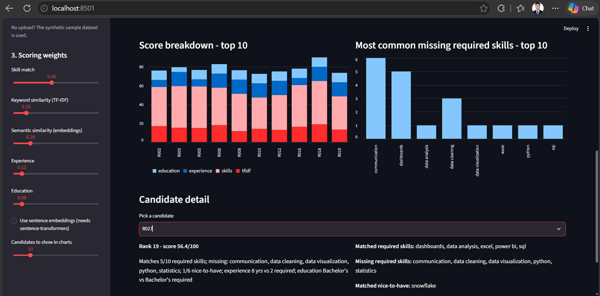

# AI-Powered Resume Screening & Candidate Ranking System
https://resume-screening-ranker.streamlit.app/

A data-analytics capstone project that screens resumes against a job description (JD), ranks candidates and
explains every score. Built with Python, scikit-learn and Streamlit.


## What it does

1. **Parses** resumes from CSV, PDF, DOCX or TXT and **redacts** emails, phone numbers and URLs.
2. **Extracts features**: skills (dictionary + aliases), years of experience, highest education level.
3. **Reads the job description**: required skills, nice-to-have skills, minimum experience and education.
4. **Scores** each candidate with a weighted combination of
   skill match, TF-IDF similarity, semantic (sentence-embedding) similarity, experience and education.
5. **Ranks and explains**: "Matches 9/10 required skills; missing: dashboards; experience 3 yrs vs 2 required".
6. **Evaluates** the ranking against hand-labelled resumes (Precision@K, NDCG@K, Spearman).
7. **Dashboard**: ranked table, score breakdown, common skill gaps, per-candidate detail, CSV download.

## Project structure

```
├── app/streamlit_app.py        # dashboard
├── data/
│   ├── job_descriptions/       # sample JDs (.txt)
│   ├── sample_resumes.csv      # SYNTHETIC resumes for quick testing
│   ├── labels.csv              # hand-labelled resumes used for evaluation
│   └── raw/                    # put the Kaggle Resume Dataset CSV here (not included, see Dataset below)
├── src/
│   ├── skills.py               # skill dictionary + aliases (edit to add skills)
│   ├── parser.py               # file readers, text cleaning, PII redaction
│   ├── features.py             # skills / experience / education extraction
│   ├── ranker.py               # JD parsing, similarity models, scoring, explanations
│   ├── evaluate.py             # Precision@K, NDCG@K, Spearman
│   └── generate_sample_data.py # creates the synthetic sample data
├── tests/                      # pytest unit tests
├── label_resumes.py            # interactive tool for hand-labelling resumes
├── run_pipeline.py             # command-line interface
└── requirements.txt
```

## Quick start

```bash
git clone https://github.com/<your-username>/resume-screening-ranker.git
cd resume-screening-ranker
python -m venv venv && source venv/bin/activate      # Windows: venv\Scripts\activate
pip install -r requirements.txt
# optional, for semantic similarity (large download):
pip install -r requirements-embeddings.txt

# rank the sample resumes for a job description
python run_pipeline.py --jd data/job_descriptions/data_analyst.txt \
    --resumes data/sample_resumes.csv --top 10 --no-embeddings

# launch the dashboard
streamlit run app/streamlit_app.py

# run the tests
pytest
```

To use your own data, pass a CSV with a text column named `Resume_str` (Kaggle *Resume Dataset* format) or
`resume_text`, or a folder of PDF/DOCX/TXT files: `--resumes path/to/folder`.

## How the score works

`final_score = 100 x sum(weight_i x component_i)` where each component is scaled to 0-1:

| Component | Default weight | How it is computed |
|---|---|---|
| Skill match | 0.45 | 80% share of required skills found + 20% share of nice-to-have skills |
| TF-IDF similarity | 0.15 | cosine similarity of resume vs JD (1-2 word n-grams), min-max scaled across candidates |
| Semantic similarity | 0.20 | sentence-embedding similarity (`all-MiniLM-L6-v2`), best 3 resume chunks, min-max scaled |
| Experience | 0.12 | `min(candidate years / required years, 1)` |
| Education | 0.08 | `min(candidate level / required level, 1)` |

Components that do not apply (no experience requirement in the JD, embeddings not installed, ...) are dropped and
the remaining weights are re-normalised. Weights can be changed in the dashboard sidebar.

## Results

Evaluated against 20 hand-labelled resumes from the Kaggle Resume Dataset (0 = not a fit, 1 = partial fit,
2 = good fit for the Data Analyst role; 5 were labelled a good fit). (Semantic/embedding similarity was not used for this evaluation run — see `--no-embeddings` above — so the final score here is skills + TF-IDF + experience + education only.)

| Method | P@3 | P@5 | P@10 | NDCG@3 | NDCG@5 | NDCG@10 | Spearman |
|---|---|---|---|---|---|---|---|
| Skill match only | 0.333 | 0.4 | 0.2 | 0.617 | 0.658 | 0.731 | 0.329 |
| TF-IDF baseline | 0.667 | 0.4 | 0.2 | 0.765 | 0.692 | 0.710 | 0.312 |
| **Final (weighted)** | 0.333 | 0.4 | 0.2 | **0.648** | **0.680** | **0.748** | **0.362** |

The final weighted score gives the best NDCG@5, NDCG@10 and Spearman correlation, meaning it places good-fit
candidates higher on average and its overall ordering agrees most closely with the manual labels. TF-IDF alone
scores higher on P@3, but with only 5 labelled "good fit" resumes out of 20, that figure is sensitive to a single
resume's position and should be read as indicative rather than conclusive. A larger labelled set would give more
reliable numbers.



## Fairness, privacy and limitations

- Emails, phone numbers and URLs are removed before scoring; names, gender, age and photos are never used as features.
- Scores can still correlate with proxies (college names, locations, employment gaps). Audit the ranking before relying on it.
- Skill extraction is dictionary-based: it misses skills that are not in `src/skills.py` and cannot judge skill *depth*.
- Experience is estimated from explicit statements or date ranges and can be wrong for unusual resume formats.
- Text-only parsing: scanned/image PDFs and heavily designed layouts may extract poorly.
- The sample dataset is synthetic; real resumes contain personal data and should not be committed to a public repository.
- This tool supports a human recruiter. It must not be the only basis for rejecting a candidate.

## Future work

- Learn skill extraction with spaCy NER or an LLM instead of a fixed dictionary
- Learning-to-rank trained on recruiter decisions
- Bias/fairness audit across candidate groups
- Multi-JD comparison, resume-improvement suggestions, database backend

## Dataset

The sample resumes in `data/sample_resumes.csv` are synthetic. The Results below were produced using the
[Kaggle Resume Dataset](https://www.kaggle.com/datasets/snehaanbhawal/resume-dataset), which is not included in
this repository (real resumes shouldn't be committed to a public repo). To reproduce the results:

1. Download the dataset from Kaggle and place `Resume.csv` in `data/raw/`.
2. Run: `python run_pipeline.py --jd data/job_descriptions/data_analyst.txt --resumes data/raw/Resume.csv --no-embeddings --labels data/labels.csv`
